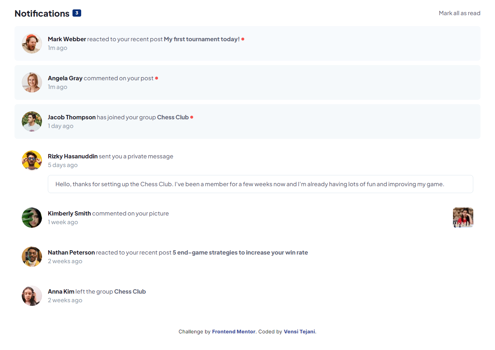

# Notifications Page Solution


## Table of Contents

- [Notifications Page Solution](#notifications-page-solution)
  - [Table of Contents](#table-of-contents)
  - [Getting Started](#getting-started)
  - [Overview](#overview)
    - [Solution Screenshot](#solution-screenshot)
    - [Links](#links)
  - [Development Process](#development-process)
    - [Built with](#built-with)
  - [Author](#author)

## Getting Started

First, run the development server:

```bash
npm run dev
```

## Overview

### Solution Screenshot



### Links

- Solution URL: [GitHub](https://github.com/vensi9/next-notification-page)
- Live Site URL: [Live Site](https://notification-page-next-tailwind.netlify.app/)

## Development Process

### Built with

- Next.js
- Tailwind CSS

## Author

- Frontend Mentor - [Vensi Tejani](https://www.frontendmentor.io/profile/vensi9)
- Twitter - [@9_Vensi](https://twitter.com/9_Vensi)
